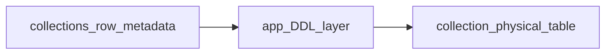

# Basalt MVP Plan

## Summary

Build a single-tenant, PocketBase-inspired admin and API for collections and records with Owner/Admin/User roles, schema migrations, CRUD UI, and headless API access. **Each collection’s row data lives in a physical Postgres table**; the `collections` row remains the source of truth for field definitions, and the app uses that metadata to **generate and migrate** the backing table (DDL). Use Next.js App Router under `src/`, shadcn + `next-themes`, and the `@` -> `src/` alias.

## Working on next

Records CRUD UI and server logic against **physical per-collection tables** (DDL: create / alter / drop table when collection schema changes).

## Foundation and Tooling

- [x] Scaffold Next.js App Router with TypeScript, Tailwind, and `src/` layout
- [x] Ensure App Router only (no `pages/` directory)
- [x] Configure `@/*` alias to `src/*` in `tsconfig.json`
- [x] Initialize shadcn and `next-themes` with class-based theme support
- [x] Add theme provider and dark mode toggle
- [x] Set up linting and formatting (ESLint, Prettier)
- [x] Add Vitest config and base test harness
- [x] Setup Docker compose file for local Postgres
- [x] Create a `.env.local` file with the local Postgres connection string

## Auth, Roles, and Onboarding

- [x] Local email/password auth (Better Auth + Drizzle + Postgres; no Clerk)
- [x] Access levels: Owner, Admin, User (`access_levels` table + seed; users link via `access_level_id`)
- [x] Owner is superuser-equivalent (enforce in app/tRPC)
- [x] Only Owner can assign Owner role
- [x] Owner role can be granted or revoked by another Owner
- [x] Admin can invite/create users and assign non-Owner roles
- [x] User can update own profile
- [x] Default Owner seeded (`pnpm db:seed`: `basalt@basalt.local` / `basalt`; change for production)
- [x] Onboarding prompt to create first collection

## Password and user editing

- [x] Profile — change own password: signed-in users can update password from `/settings/profile` (e.g. current password + new password; use Better Auth email/password API and validation).
- [x] Admin — edit any user and set password: Owners and Admins (`adminProcedure` on the `users` tRPC router) can edit existing users, not only create users and change access level. Include setting a new password for credential accounts (`hashPassword` + `account` row with `providerId: "credential"`, same pattern as user create).
- [x] Policy consistency: reuse or extend `role-policy` and the same Owner-only rules as `updateAccessLevel` so admins cannot escalate beyond existing rules when editing roles or sensitive fields.
- [x] Admin edit surface: at minimum name + optional new password; email change only with an explicit rule (uniqueness, verification, Better Auth support).
- [x] Tests: Vitest coverage or smoke coverage for self password change and admin-set password (can align with Tests and Acceptance later).
- [ ] Avatar: By default set random avatar using: https://robohash.org (later)

## Collections and Schema

- [x] Create, edit, delete collections
- [x] Field types: text, number, boolean, date, json
- [x] Field settings: required, default value, unique
- [x] Enforce schema change rules
- [x] Support field renames
- [x] Restrict unsafe type changes
- [x] Require explicit confirmation before deleting fields
- [ ] **Physical table per collection**: on create and on schema change, run DDL (`CREATE TABLE`, `ALTER TABLE`, renames / drops per confirmation rules) so row data lives in real columns—not a generic jsonb payload or in-memory-only structure.
- [ ] **Drizzle checked-in migrations** only for platform/base tables (`users`, auth, `collections` metadata registry, etc.); **per-collection data tables** are not separate `drizzle-kit generate` artifacts—they are applied by the app with controlled SQL (no checked-in migration file per user collection).
- [ ] **Stable physical table identity** tied to `collections.id` (immutable); slug / display renames update metadata and may rename the table per a defined policy without orphaning data.
- [ ] **Column type mapping**: e.g. text → `text`, number → `double precision` (or `numeric`), boolean → `boolean`, date → `timestamptz`, json → `jsonb`; plus system columns for audit when Audit Trail ships (`created_at`, `updated_at`, `created_by`, `updated_by`).

## Records and Admin UI

- [ ] List / insert / update / delete rows with **parameterized SQL** against the collection’s physical table (resolve table and columns from `collections` metadata by `collection_id`).
- [ ] CRUD UI for any collection
- [ ] Forms for editing any collections or tables should slide into view or load on a whole new page
- [ ] Add a settings section with the option to have collections slide in/out from the right, or display a whole page
- [ ] Table view with pagination (default 25 per page)
- [ ] Search with simple contains across **text columns** (e.g. `ILIKE` on mapped `text` fields)
- [ ] Default sort by `created_at` desc with user override
- [ ] Record detail view with inline editing
- [ ] Validation rules
- [ ] Text min and max length
- [ ] Number min and max
- [ ] JSON validity checks
- [ ] Display validation errors in UI

## API Access and Permissions

- [ ] tRPC for internal app usage
- [ ] REST-ish JSON endpoints for external usage
- [ ] API key auth via `Authorization: Bearer <key>`
- [ ] Error shape `{ "error": { "code": string, "message": string } }`
- [ ] API keys scoped by role and optional collection allowlist
- [ ] Per-collection API permissions toggles for read/create/update/delete
- [ ] Per-endpoint role requirements (admin-only or owner-only)
- [ ] Rate limiting per API key (configurable constant)

## Import and Export

- [ ] Export collections as JSON, SQL, or CSV (**schema metadata + row data from physical tables**)
- [ ] Include collection schema + data in export payloads (tables + rows)
- [ ] Import into another instance from JSON, SQL, or CSV exports
- [ ] Validate import compatibility and surface errors

## Audit Trail

- [ ] Add audit fields on **each collection’s physical data table** as normal columns (`created_at`, `updated_at`, `created_by`, `updated_by`), not only in registry metadata
- [ ] `created_at`, `updated_at`, `created_by`, `updated_by`
- [ ] Audit fields are system-owned and immutable
- [ ] Show audit fields read-only in record detail

## Example Content and Seeds

- [ ] Create default `posts` collection (metadata row + **physical table** via DDL)
- [ ] Seed local dev data into the **`posts` physical table**

## UI and UX

- [ ] Mobile-friendly responsive layout
- [ ] Dark mode toggle in header or settings

## Ops, Environment, and Deployment

- [x] Local Docker Postgres setup
- [x] Drizzle config and migrations pipeline (`drizzle.config.ts`, `pnpm db:generate` / `db:migrate` / `db:push`, `pnpm db:seed`)
- [ ] **Checked-in Drizzle migrations** = platform/base schema only (users, auth, `collections` metadata registry, logs, etc.); **per-collection data tables** are created and evolved **at runtime** via app-issued DDL with idempotent guards and logging (backups / runbooks TBD for production)
- [ ] Environment config for local and production
- [ ] Vercel deployment uses App Router defaults

## Tests and Acceptance

- [ ] Smoke test: auth flow (login, logout)
- [ ] Smoke test: create/edit/delete collection
- [ ] Smoke test: create/edit/delete **record rows in a collection’s physical table**
- [ ] Smoke test: API key access for read and write
- [ ] Build passes with `pnpm build`

## Non-Goals (MVP)

- [ ] No multi-tenant organizations
- [ ] No file uploads or storage
- [ ] No realtime subscriptions
- [ ] No advanced query builder
- [ ] No OAuth providers beyond email/password
