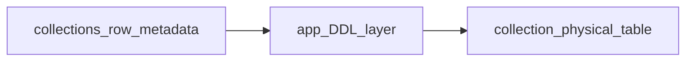
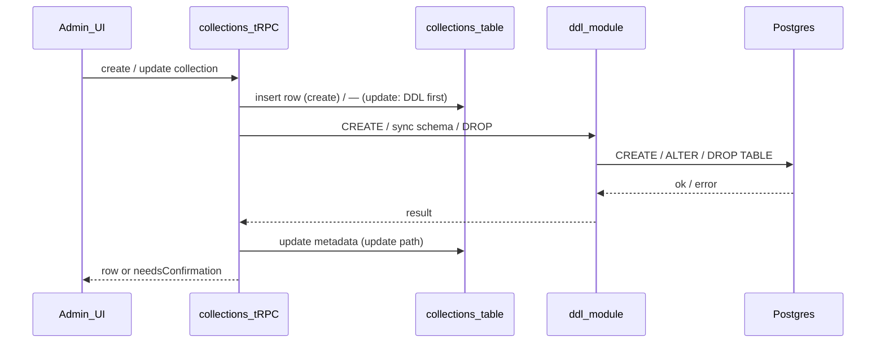

# Basalt MVP Plan

## Summary

Build a single-tenant, PocketBase-inspired admin and API for collections and records with Owner/Admin/User roles, schema migrations, CRUD UI, and headless API access. **Each collection’s row data lives in a physical Postgres table** named `col_<suffix>` where **`<suffix>` is fixed at creation** (typically the slug the user chose when creating the collection); the `collections` row remains the source of truth for field definitions, and the app uses that metadata to **generate and migrate** the backing table (DDL). **Changing `slug` later does not rename** the Postgres table. Use Next.js App Router under `src/`, shadcn + `next-themes`, and the `@` -> `src/` alias.

## Working on next

**Audit trail** beyond `created_at` on physical data tables (`updated_at`, `created_by`, `updated_by`); richer **record UX** (optional slide-in panels vs full page); **import/export**; smoke/acceptance tests for auth, collections, records, and `/api/v1`.

## Foundation and Tooling

- [x] Scaffold Next.js App Router with TypeScript, Tailwind, and `src/` layout
- [x] Ensure App Router only (no `pages/` directory)
- [x] Configure `@/*` alias to `src/*` in `tsconfig.json`
- [x] Initialize shadcn and `next-themes` with class-based theme support
- [x] Add theme provider and dark mode toggle
- [x] Set up linting and formatting (ESLint, Prettier)
- [x] Add Vitest config and base test harness
- [x] Setup Docker compose file for local Postgres
- [x] Create a `.env.local` file with the local Postgres connection string

## Auth, Roles, and Onboarding

- [x] Local email/password auth (Better Auth + Drizzle + Postgres; no Clerk)
- [x] Access levels: Owner, Admin, User (`access_levels` table + seed; users link via `access_level_id`)
- [x] Owner is superuser-equivalent (enforce in app/tRPC)
- [x] Only Owner can assign Owner role
- [x] Owner role can be granted or revoked by another Owner
- [x] Admin can invite/create users and assign non-Owner roles
- [x] User can update own profile
- [x] Default Owner seeded (`pnpm db:seed`: `basalt@basalt.local` / `basalt`; change for production)
- [x] Onboarding prompt to create first collection

## Password and user editing

- [x] Profile — change own password: signed-in users can update password from `/settings/profile` (e.g. current password + new password; use Better Auth email/password API and validation).
- [x] Admin — edit any user and set password: Owners and Admins (`adminProcedure` on the `users` tRPC router) can edit existing users, not only create users and change access level. Include setting a new password for credential accounts (`hashPassword` + `account` row with `providerId: "credential"`, same pattern as user create).
- [x] Policy consistency: reuse or extend `role-policy` and the same Owner-only rules as `updateAccessLevel` so admins cannot escalate beyond existing rules when editing roles or sensitive fields.
- [x] Admin edit surface: at minimum name + optional new password; email change only with an explicit rule (uniqueness, verification, Better Auth support).
- [x] Tests: Vitest coverage or smoke coverage for self password change and admin-set password (can align with Tests and Acceptance later).
- [ ] Avatar: By default set random avatar using: https://robohash.org (later)

## Collections and Schema

- [x] Create, edit, delete collections
- [x] Field types: text, number, boolean, date, json
- [x] Field settings: required, default value, unique
- [x] Enforce schema change rules
- [x] Support field renames
- [x] Restrict unsafe type changes
- [x] Require explicit confirmation before deleting fields
- [x] **Physical table per collection**: on create and on schema change, run DDL (`CREATE TABLE`, `ALTER TABLE`, renames / drops per confirmation rules) so row data lives in real columns—not a generic jsonb payload or in-memory-only structure. Implemented in [`src/server/collection-data-ddl.ts`](src/server/collection-data-ddl.ts), wired from [`collections` tRPC router](src/server/api/routers/collections.ts).
- [x] **Drizzle checked-in migrations** only for platform/base tables (`users`, auth, `collections` metadata registry, etc.); **per-collection data tables** are not separate `drizzle-kit generate` artifacts—they are applied by the app with controlled SQL (no checked-in migration file per user collection).
- [x] **Physical table naming:** `col_<suffix>` where **`<suffix>` is user-chosen at create time** (same validation as slug: lowercase, digits, underscores) and **stored immutably** on the collection row as **`table_suffix`**. **`slug`** may change later for URLs and labels; **do not** `RENAME TABLE`—the heap name stays `col_<original_suffix>`. **`collections.id`** remains the metadata/API primary key and is **not** part of the table name.
- [x] **Column type mapping** (MVP): text → `text`, number → `double precision`, boolean → `boolean`, date → `timestamptz`, json → `jsonb`; row PK `id uuid`. **`created_at`** on each `col_*` table is implemented (see Audit Trail). **`updated_at`, `created_by`, `updated_by`** remain planned.

### Registry (implemented)

The `collections` table in [`src/db/schema.ts`](src/db/schema.ts) is the **metadata registry**: `id` (UUID PK), `slug`, immutable **`table_suffix`** (physical table `col_<table_suffix>`), human **`name`**, and `fields` as JSONB typed as `CollectionFieldDefinition[]`. **`slug`** is user-set (with validation) and **may be updated** without touching the data table. **`table_suffix`** is set once at create (typically equal to `slug`) and is not updated when the slug changes. Admin CRUD lives on the [`collections`](src/server/api/routers/collections.ts) tRPC router. Field shape, defaults, unsafe-type detection, rename vs remove semantics, and confirmation tokens (`removedFieldIds`, `confirmedUnsafeTypeFieldIds`) are centralized in [`src/lib/collection-fields.ts`](src/lib/collection-fields.ts). Each field has a stable **`id` (UUID)** for metadata identity and a **`name`** that is the **physical column name** in `col_<table_suffix>`.

### Physical layer (implemented)

**Table name (Postgres):** `col_<table_suffix>` where **`table_suffix` is immutable** after create (user picks it at creation; same rules as slug). **`slug` and `name` can change** without DDL on the data table. Resolve the heap with **`col_` + `table_suffix`**, never with the current `slug` alone. The **`col_` prefix** namespaces Basalt data tables and keeps the identifier letter-led for unquoted SQL. **Length:** Postgres truncates at 63 bytes—cap **`table_suffix`** (and create-time slug if they must match) so `col_` + suffix fits (59 chars max for the suffix with a 4-character prefix).

**Row primary key:** Add a dedicated `id uuid PRIMARY KEY DEFAULT gen_random_uuid()` on every data table (Basalt record id). User-defined fields are additional columns; do not overload the collection slug or metadata id as the row PK exposed to the API.

**Reserved column names:** Treat `id`, `created_at`, and (when implemented) `updated_at`, `created_by`, `updated_by` as system-owned. Validation in `collection-fields` / UI should reject field `name` collisions with those identifiers.

**DDL lifecycle (sketch):**

| Event                                     | Physical action                                                                                                                                                   |
| ----------------------------------------- | ----------------------------------------------------------------------------------------------------------------------------------------------------------------- |
| Collection create                         | `CREATE TABLE col_<table_suffix>` with system columns + one column per field (constraints: `NOT NULL`, `UNIQUE`, `DEFAULT` per metadata); persist `table_suffix`. |
| **Slug change (metadata only)**           | Update `collections.slug` only—**no** `RENAME TABLE`.                                                                                                             |
| Field added                               | `ALTER TABLE … ADD COLUMN`.                                                                                                                                       |
| Field renamed (same id, new machine name) | `ALTER TABLE … RENAME COLUMN` (preserve data).                                                                                                                    |
| Field removed (after confirmation)        | `ALTER TABLE … DROP COLUMN`.                                                                                                                                      |
| Unsafe type change (after confirmation)   | Add new column, backfill/cast where possible, drop old—or single `ALTER` with explicit cast strategy per type pair (document failure modes).                      |
| Collection delete                         | `DROP TABLE IF EXISTS` for the physical table, then delete metadata row (order: avoid leaving metadata pointing at a missing table).                              |

DDL runs in [`src/server/collection-data-ddl.ts`](src/server/collection-data-ddl.ts) with allowlisted identifiers: **table name** = `col_` + **`table_suffix`**, **column names** from field `name`. **Transactions:** create wraps insert + `CREATE TABLE` in one `db.transaction` (rollback on DDL failure). Update runs **sync DDL then metadata update** in a transaction. **Legacy rows** without a physical table get `CREATE TABLE` on first successful update (`collectionDataTableExists`). **Not yet in MVP:** per-statement logging, `information_schema` reconciliation, and idempotent `CREATE` guards beyond transaction rollback.

### Postgres type mapping (MVP)

| Field type | Physical type      | Notes                                                                          |
| ---------- | ------------------ | ------------------------------------------------------------------------------ |
| `text`     | `text`             | Search uses `ILIKE` on these columns only (see Records).                       |
| `number`   | `double precision` | Simpler than `numeric` for MVP; document precision limits if you switch later. |
| `boolean`  | `boolean`          |                                                                                |
| `date`     | `timestamptz`      | Store instants; serialize ISO-8601 on the wire.                                |
| `json`     | `jsonb`            | Validate JSON on write in app layer before insert/update.                      |

`NOT NULL`, `UNIQUE`, and `DEFAULT` should mirror metadata where Postgres allows it. **Check constraints** for min/max length and number ranges can wait until the validation-rules checklist ships, or be added incrementally per field settings.

### Metadata vs physical schema

Treat **`collections.fields` as authoritative** for app behavior. After DDL, optional **reconciliation** (compare `information_schema.columns` to expected columns from metadata) helps catch manual DB edits or partial failures; MVP can log warnings on mismatch rather than building a full repair UI. On collection load for records CRUD, resolve **table name** from **`col_` + `collection.table_suffix`** (immutable) and column list from `fields`—if a column is missing, fail the request with a clear error until an admin fixes the collection or a repair job runs.

### Ordering and failure handling

**Recommended order on create:** insert metadata row first (including **`table_suffix`**), then `CREATE TABLE col_<table_suffix>` in the **same transaction**; on failure the transaction rolls back (no orphan metadata row).

**Recommended order on update:** validate confirmations server-side (already done). Apply field DDL against **`col_<table_suffix>`** to match the **new** field set, then commit metadata update (**`slug` / `name` changes are ordinary column updates**, no table rename). If DDL fails after partial alters, avoid writing metadata that describes columns that do not exist—either roll back DDL steps (hard) or keep metadata at previous version and return an error (simpler MVP).

**Delete:** `DROP TABLE` first (or rename to a quarantine name), then delete the `collections` row, so a failed drop does not orphan a large table while metadata is gone.

## Records and Admin UI

### Access layer (implemented)

Server module [`src/server/collection-records.ts`](src/server/collection-records.ts) (plus [`src/lib/ilike-escape.ts`](src/lib/ilike-escape.ts) for search patterns):

1. Loads the collection row by `id`, parses `fields`, and resolves **physical table name** as **`col_` + `table_suffix`** (immutable, not the live `slug`).
2. Runs **parameterized** `SELECT` / `INSERT` / `UPDATE` / `DELETE` via `pg` with allowlisted table/column identifiers from metadata only.
3. Maps row `id` and dynamic columns to/from JSON for tRPC and the admin UI.

**tRPC:** [`records` router](src/server/api/routers/records.ts) (`list`, `byId`, `create`, `update`, `delete`) on **`adminProcedure`**, merged in [`src/server/api/root.ts`](src/server/api/root.ts).

**Admin routes:** `/collections/[collectionId]/records`, `…/records/new`, `…/records/[recordId]` under [`src/app/collections/[collectionId]/records/`](src/app/collections/[collectionId]/records/). List + links from [`collections-list.tsx`](src/app/collections/collections-list.tsx) and **View records** on the collection editor.

**Pagination:** `LIMIT` / `OFFSET` (default **25** per page). **Sort:** default `ORDER BY created_at DESC` (tie-break `id DESC`); physical tables include **`created_at timestamptz NOT NULL DEFAULT now()`** (added on create, and `ALTER TABLE … ADD COLUMN IF NOT EXISTS` when loading targets / syncing schema). The records list UI can sort by **Created**, **id**, or any collection field (asc/desc).

**Search:** Single bound pattern across all **`text`** fields: `ILIKE` with `ESCAPE '\'`; user input escaped via `escapeIlikePattern` ([`src/lib/ilike-escape.ts`](src/lib/ilike-escape.ts); covered in [`src/lib/ilike-escape.spec.ts`](src/lib/ilike-escape.spec.ts)).

**Records UX:** Create saves then redirects to the **records listing** (not the new row’s edit URL). Record create/edit uses a **`<form>`** so **Enter** submits from single-line inputs. The records table supports **inline editing** via an expandable row ([`records-list.tsx`](src/app/collections/[collectionId]/records/records-list.tsx)) that reuses [`record-form.tsx`](src/app/collections/[collectionId]/records/record-form.tsx) field inputs; the dedicated edit page remains. **Field validation** (optional min/max **text length** and **number** bounds) is stored in collection metadata ([`collection-fields.ts`](src/lib/collection-fields.ts)), edited in [`collection-editor.tsx`](src/app/collections/collection-editor.tsx), and enforced on create/update in [`collection-records.ts`](src/server/collection-records.ts) plus client-side in the record form. **Machine field names** (`snake_case`) are shown human-readably in the table and record form via **`humanizeFieldMachineName`**. **`buttonVariants`** for `Link` styling on server pages lives in [`src/components/ui/button-variants.ts`](src/components/ui/button-variants.ts) (no `"use client"` on that module). **No Drizzle migration** is required for `created_at` on `col_*` tables: the app adds the column at runtime (`ADD COLUMN IF NOT EXISTS` when loading a collection target or syncing schema).

- [x] List / insert / update / delete rows with **parameterized SQL** against the collection’s physical table (resolve table and columns from `collections` metadata by `collection_id`).
- [x] CRUD UI for any collection
- [ ] Forms for editing any collections or tables should slide into view or load on a whole new page (later)
- [ ] Add a settings section with the option to have collections slide in/out from the right, or display a whole page (later)
- [x] Table view with pagination (default 25 per page)
- [x] Search with simple contains across **text columns** (e.g. `ILIKE` on mapped `text` fields)
- [x] Default sort by `created_at` desc with user override
- [x] Record detail view with inline editing (expandable row on the records table; full **edit page** still available)
- [x] Validation rules (metadata-driven min/max, etc.)
- [x] Text min and max length
- [x] Number min and max
- [x] JSON validity checks (parse/validate on write in app + forms)
- [x] Display validation errors in UI (form + tRPC error messages)
- [x] Human-friendly labels for snake_case field names in records list + record form (machine `name` unchanged in API/DB)

## API Access and Permissions

- [x] tRPC for internal app usage (admin: `me`, `users`, `apiKeys`, `collections`, `records`; shapes evolve with the app)
- [x] REST-ish JSON endpoints for external usage (`/api/v1/collections`, records under `/api/v1/collections/:slug/records`, etc.)
- [x] API key auth via `Authorization: Bearer <key>` (plaintext shown once on create via `apiKeys.create`)
- [x] Error shape `{ "error": { "code": string, "message": string } }`; **5xx** responses use a **generic** client message for `INTERNAL_ERROR` with full detail **logged server-side** (no stack/DB text in the JSON body)
- [x] API keys scoped by role and optional collection allowlist
- [x] Per-collection API permissions toggles for read/create/update/delete (`collections.api_permissions` + `PATCH .../api-permissions`)
- [x] Per-endpoint role requirements (admin-only or owner-only)
- [x] **Rate limiting:** fixed **60s window**, **in-process** counters (not shared across Node instances—use an edge proxy or Redis if you need a global cap). **`API_KEY_RATE_LIMIT_PER_MINUTE`** caps authenticated traffic **per verified API key**; **`API_V1_RATE_LIMIT_PER_IP_PER_MINUTE`** applies **per client IP** (from `x-forwarded-for` / `x-real-ip`) **before** key resolution to throttle invalid-key and missing-key floods. Bounded maps with stale eviction in [`src/server/rest/api-key-rate-limit.ts`](src/server/rest/api-key-rate-limit.ts).
- [x] **API key verification:** `scrypt` verification is **async** (non-blocking); bearer tokens must match a **strict** `bslt_` + base64url shape and max length before DB lookup (see [`src/server/api-key-crypto.ts`](src/server/api-key-crypto.ts))

## Import and Export

- [ ] Export collections as JSON, SQL, or CSV (**schema metadata + row data from physical tables**)
- [ ] Include collection schema + data in export payloads (tables + rows)
- [ ] Import into another instance from JSON, SQL, or CSV exports
- [ ] Validate import compatibility and surface errors

## Audit Trail

- [x] `created_at` on **each collection’s physical data table** (`timestamptz NOT NULL DEFAULT now()` on new tables; `ADD COLUMN IF NOT EXISTS` for legacy tables when the app loads the target or runs schema sync). Used for default list ordering. Rows that existed before the column was added get a backfill timestamp at add time, not the original insert time.
- [x] `updated_at`, `created_by`, `updated_by` on physical data tables
- [x] Audit fields beyond `created_at` are system-owned and immutable from record APIs
- [x] Show full audit block read-only on record detail (list/table already shows **Created**)

## Example Content and Seeds

- [x] Create default `posts` collection (metadata row + physical table **`col_posts`** via DDL)
- [x] Seed local dev data into **`col_posts`**

## UI and UX

- [x] Dark mode toggle in header ([`ThemeToggle`](src/components/theme-toggle.tsx) in [`AppHeader`](src/components/app-header.tsx))

## Ops, Environment, and Deployment

- [x] Local Docker Postgres setup
- [x] Drizzle config and migrations pipeline (`drizzle.config.ts`, `pnpm db:generate` / `db:migrate` / `db:push`, `pnpm db:seed`)
- [ ] **Checked-in Drizzle migrations** = platform/base schema only (users, auth, `collections` metadata registry, logs, etc.); **per-collection data tables** are created and evolved **at runtime** via app-issued DDL with idempotent guards and logging (backups / runbooks TBD for production)
- [ ] Environment config for local and production
- [ ] Vercel deployment uses App Router defaults

## Tests and Acceptance

- [x] Smoke test: auth flow (login, logout)
- [x] Smoke test: create/edit/delete collection
- [x] Smoke test: create/edit/delete **record rows in a collection’s physical table**
- [x] Smoke test: API key access for read and write (manual or Playwright against `/api/v1`)
- [x] Build passes with `pnpm build`

## Later (After first initial MVP is built)

- [ ] Mobile-friendly responsive layout

## Non-Goals (MVP)

- [ ] No multi-tenant organizations
- [ ] No file uploads or storage
- [ ] No realtime subscriptions
- [ ] No advanced query builder
- [ ] No OAuth providers beyond email/password
